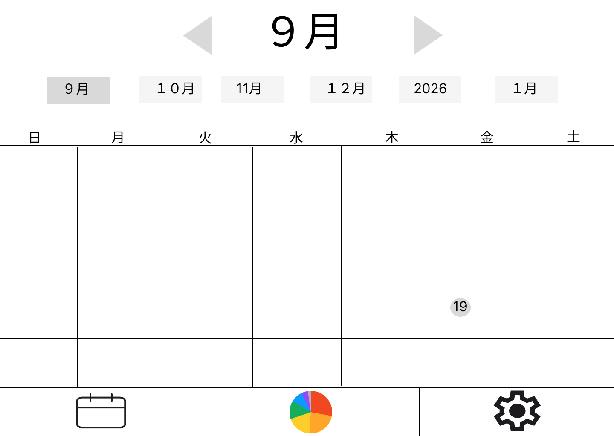

# カレンダー画面

### 機能概要

- カレンダー画面です。
- 日付を選択するとその日の行動ログが表示されます。
- 日付の左隣の矢印を押すと前の行動ログが表示されます。
- 日付の右隣の矢印を押すと次の行動ログが表示されます。
- 日付下に表示されている月ボタンを押すとその月のカレンダーが表示されます。
- 当日の日付の背景に円形のマークが表示されます。
- カレンダーアイコンを押すとカレンダーページへ遷移します。
- 円グラフアイコンを押すと表示されている行動ログの日付のデータページへ遷移します。
- 歯車アイコンを押すと設定ページへ遷移します。

### 画面イメージ

- カレンダー
  
