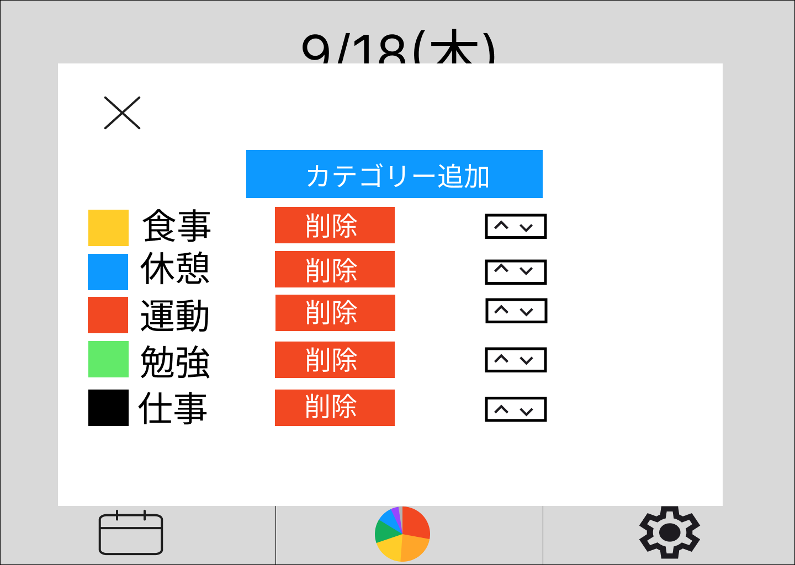
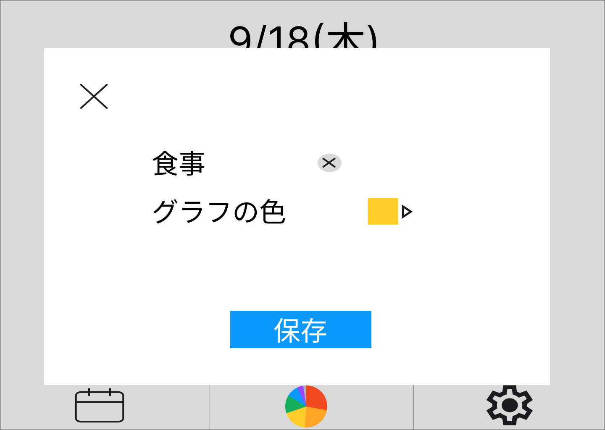
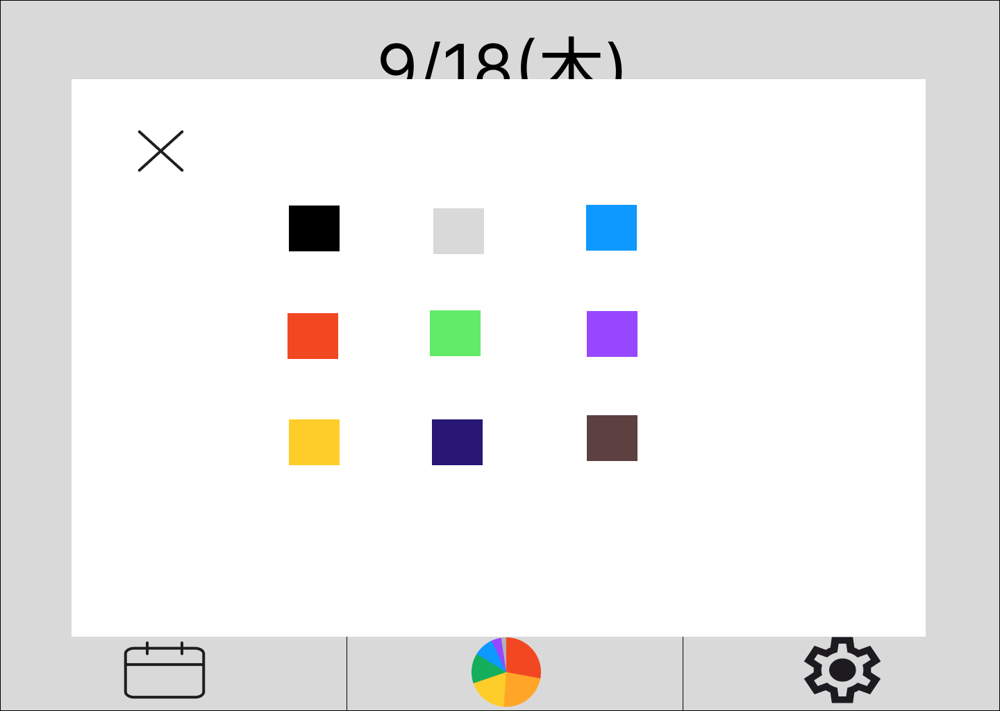

# カテゴリー追加編集画面

### 機能概要

- カテゴリーを一覧表示します。
- カテゴリー追加又はカテゴリー名を押すとカテゴリー入力画面が表示されます。
- 削除ボタンを押すとカテゴリーを削除できます。確認ダイアログで削除確認をします。
- 上下矢印ボタンをドラッグするとカテゴリーの順番を任意の場所に変更できます。
- ×を押すと行動ログ入力画面に戻ります。
- 入力画面の×を押すと入力欄からの状態にできます。
- グラフの色のアイコンを押すとカラーバレットが表示されます。
- カラーパレットのカラーを選択するとその色が反映されます。

### 画面イメージ

- カテゴリー編集一覧画面
  
- カテゴリー編集入力画面
  
- カテゴリー編集カラーパレット画面
  
