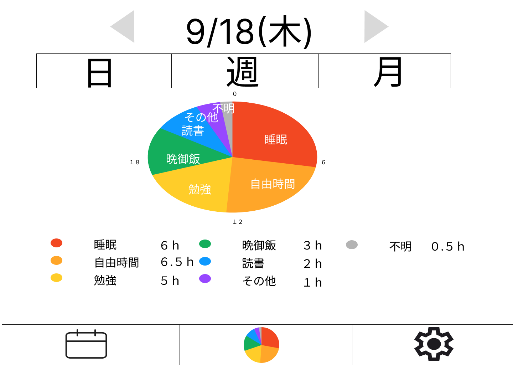

# データ画面

### 機能概要

- 行動ログのデータを日、週、月。それぞれ集計し表示します。
- 円グラフで日単位の場合は時間を週や月単位の場合はパーセンテージで表示します。
- 円グラフの下には日単位ならそれぞれの時間、週や月単位ならそれぞれのパーセンテージを表示します。
- 日付の左隣の矢印を押すと前のデータが表示されます。
- 日付の右隣の矢印を押すと次のデータが表示されます。
- 日付下の日、週、月ボタンを押すと単位が切り替わります。
- カレンダーアイコンを押すとカレンダーページへ遷移します。
- 円グラフアイコンを押すとデータページへ遷移します。
- 歯車アイコンを押すと設定ページへ遷移します。

### 画面イメージ

- 日単位のデータ画面イメージ
  
