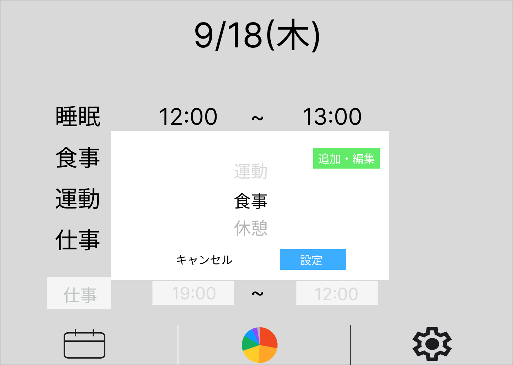

# ホーム画面

### 機能概要

- アプリのメインのページです。行動ログ一覧を表示します。
- 一覧の一番下の行動入力欄を押すとダイアルが表示され登録できます。
- 一覧の一番下の時間入力欄を押すとダイアルが表示され登録できます。
- 一覧の入力済の行動や時間を押すとダイアルが表示され編集や削除できます。
- 時間の設定は 15 分単位で出来るようにしてあり変更はできません。
- 行動のカテゴリーは追加したり編集できます。また、削除することも可能です。
- 追加編集ボタンを押すと行動カテゴリー追加編集画面へ遷移します。
- 日付の左隣の矢印を押すと前の行動ログが表示されます。
- 日付の右隣の矢印を押すと次の行動ログが表示されます。
- カレンダーアイコンを押すとカレンダーページへ遷移します。
- 円グラフアイコンを押すと表示されている行動ログの日付のデータページへ遷移します。
- 歯車アイコンを押すと設定ページへ遷移します。

### 画面イメージ

- ホーム画面
  

- 行動ログ新規登録時
  
  
- 行動ログ編集時
  
  
