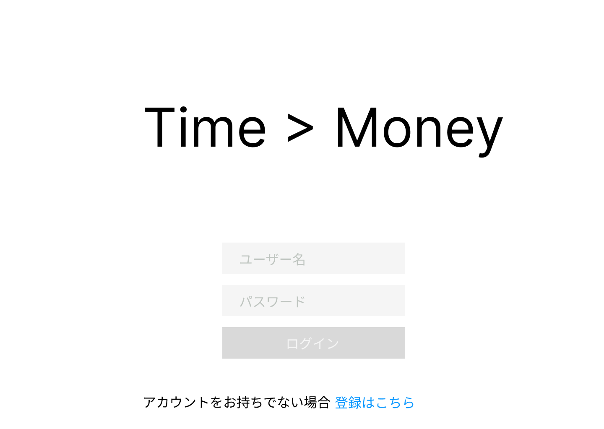

# ログイン画面

### 機能概要

- ログイン画面です。最初にこの画面が表示されます。
- 登録済みユーザーはユーザー名とパスワードを入力してログインしホーム画面へ遷移します。
- 新規ユーザーはユーザー登録画面より登録後ログインしホーム画面へ遷移します。
- ユーザ名が正しくない場合はエラーメッセージをタイトル下に表示します。

### 画面イメージ

- 登録済みユーザ
  
  - エラー時
    
- 新規ユーザ
  
  - エラー時
    
