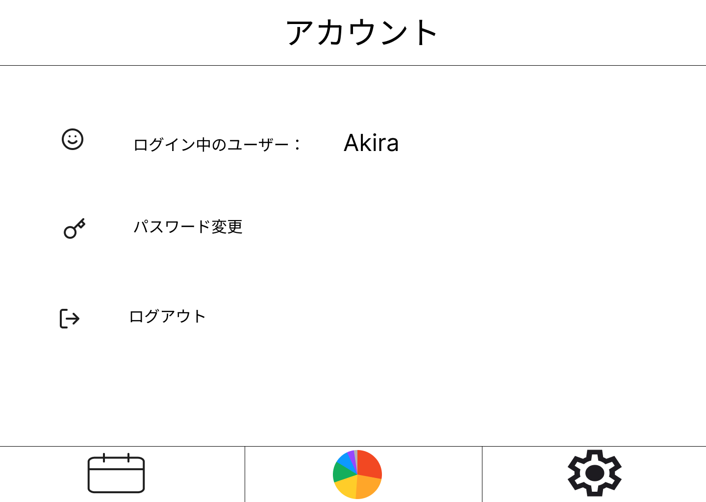
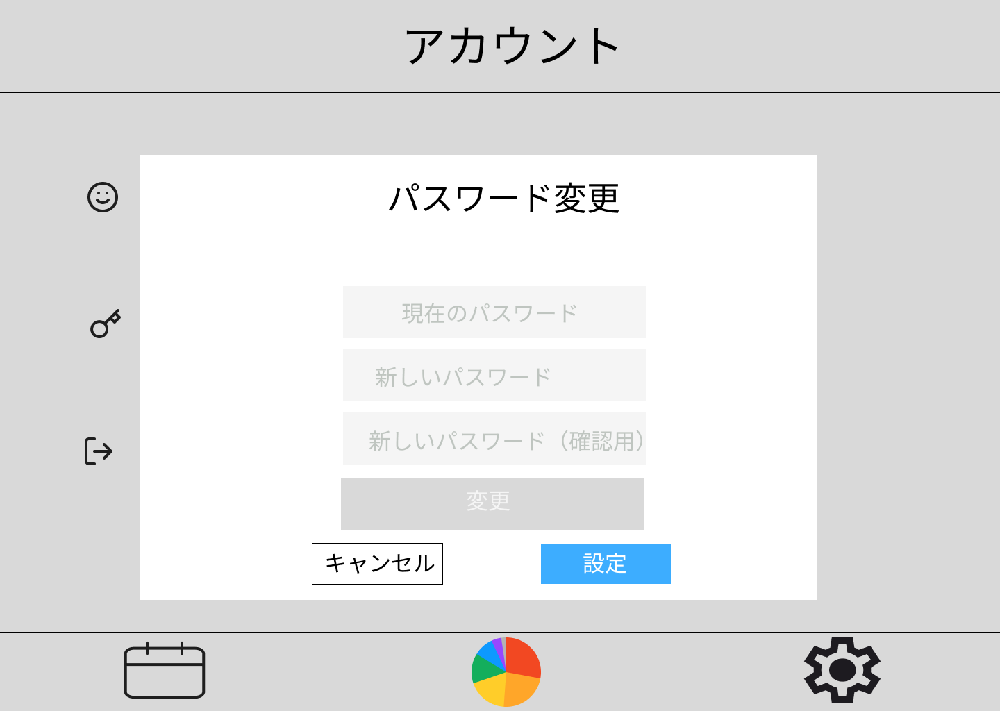
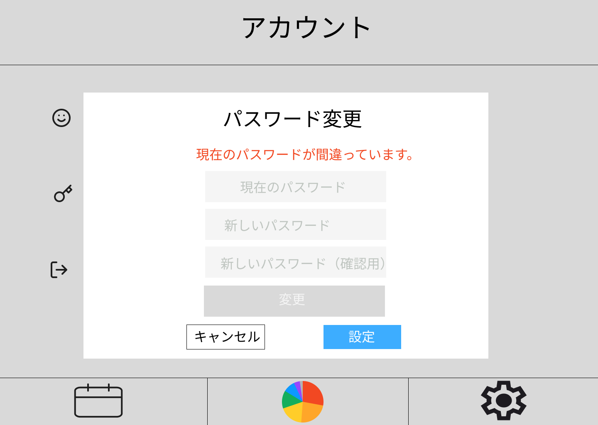

# 設定画面

### 機能概要

- ログイン中のユーザー名を表示します。
- パスワードを変更できます。
- ログアウトできます。
- カレンダーアイコンを押すとカレンダーページへ遷移します。
- 円グラフアイコンを押すと表示されている行動ログの日付のデータページへ遷移します。
- 歯車アイコンを押すと設定ページへ遷移します。

### 画面イメージ

  - 設定画面
   
  - パスワード変更画面
   
  - パスワード変更エラー画面
   
